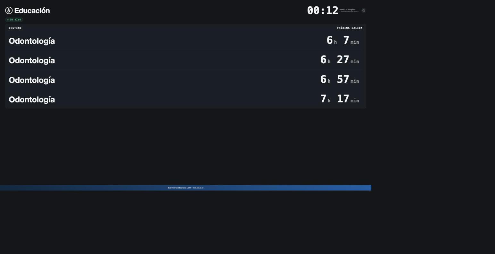

<!--
  ⚠️ SINGLE PLACE TO EDIT: the live board URL lives in slides.md, in the
  `board-frame.vue` component below, as the constant BOARD_URL.
  See presentation/README.md for how to swap it.
-->

# bUCR — Próximas salidas

Live departure-board demo

  bucr-screen · departure board for a single bUCR stop

---
layout: default
---

<!--
  Centerpiece slide: the live board, embedded via iframe over a Tailscale
  Funnel HTTPS URL. The board's own layout is a kiosk aspect ratio, not
  16:9, so we render it at a fixed logical width/height and scale the
  whole thing down to fit the slide — no squish, no scrollbars.
-->

  <iframe
    class="board-iframe"
    :src="BOARD_URL"
    title="bUCR — Próximas salidas (live departure board)"
    loading="eager"
    referrerpolicy="no-referrer"
    sandbox="allow-scripts allow-same-origin"
  />

  Live · served over a Tailscale Funnel HTTPS URL

<!--
Speaker notes:
This slide embeds the live board over a Tailscale Funnel HTTPS URL. It
depends on the venue's network reaching that URL. If it doesn't load in a
few seconds, or the network is unreliable, skip straight to the next
slide — a static screenshot of the same board.
-->

---
layout: center
---

<!--
  Fallback slide. Uses a relative  path (resolved by Vite at build
  time) rather than an absolute /public path, so the screenshot can live
  in presentation/assets/ alongside the deck instead of presentation/public/.
-->

  

  Fallback screenshot — same board, no live network dependency

<!--
Speaker notes:
FALLBACK SLIDE — use this if the live iframe on the previous slide didn't
load (bad venue wifi, Funnel down, etc). It's a plain screenshot of the
same board, so the talk reads as intentional either way. No live network
dependency here.
-->
